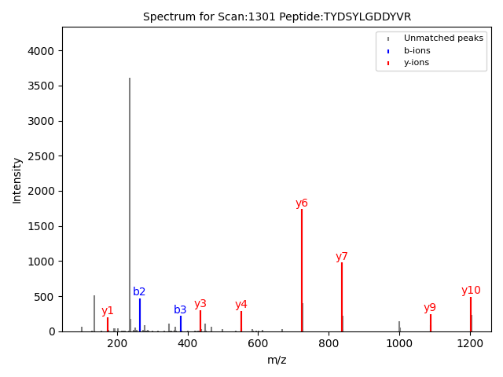

## Peptide Fragmentation Spectrum

A Python program for visualizing peptide fragmentation spectra from mzXML 
mass spectrometry data.

The program takes an mzXML file, a scan number, and a peptide sequence as
inputs. It calculates theoretical b-ion and y-ion m/z values for the peptide,
matches them to experimental peaks in the selected MS/MS spectrum, and
annotates matching peaks on the resulting spectrum.

## Project Overview

In tandem mass spectrometry (MS/MS), peptides can be fragmented into
characteristic b- and y-ions. Comparing theoretical fragment ion masses with
experimental spectra can help assess whether a proposed peptide sequence is
consistent with the observed spectrum.

This project performs this comparison by:

1. Reading a compressed mzXML file.
2. Selecting a specified scan.
3. Extracting experimental m/z and intensity values.
4. Calculating theoretical b-ion and y-ion m/z values from a peptide sequence.
5. Matching theoretical ions to experimental peaks within a specified m/z
   tolerance.
6. Annotating matched b- and y-ions on the experimental spectrum.
7. Displaying the resulting annotated spectrum.

The example commands in this repository were developed using the
`17mix_test2.mzxml` dataset provided for the course.

## Methods

### Fragment ion calculation

The program calculates theoretical b-ion and y-ion masses from the input peptide sequence.

- b-ions are calculated from the N-terminus of the peptide.
- y-ions are calculated from the C-terminus of the peptide.

### Peak matching

Theoretical fragment ions are matched to experimental peaks using an m/z tolerance of 0.05 Da.

If multiple experimental peaks fall within the tolerance window, the highest-intensity peak is selected as the match.

Only peaks with an intensity of at least 5% of the maximum intensity in the spectrum are considered for matching.

### Example Dataset
The example commands in this repository were developed using the 17mix_test2.mzxml dataset provided for the course.

The dataset itself is not included in this repository.

## Example Output 

The program produces an annotated MS/MS spectrum:

- **Blue:** matched b-ions
- **Red:** matched y-ions
- **Gray:** unmatched experimental peaks



## Requirements

Python 3.x

Required Python packages:

- NumPy
- Matplotlib

The program also uses Python standard-library modules including:
- `sys`
- `gzip`
- `base64`
- `xml.etree.ElementTree`
- `array`

## Installation

Clone the repository and install the required Python packages:

```bash
git clone https://github.com/Sharadha723/MS-MS_Peptide_Fragmentation_Viewer.git
cd MS-MS_Peptide_Fragmentation_Viewer
pip install -r requirements.txt
```
## Usage

Run the program from the command line using:

```bash
python peptide_fragmentation_spectrum.py <mzXML_file> <scan_number> <peptide_sequence>

```
## Author
Sarada Giridharan
